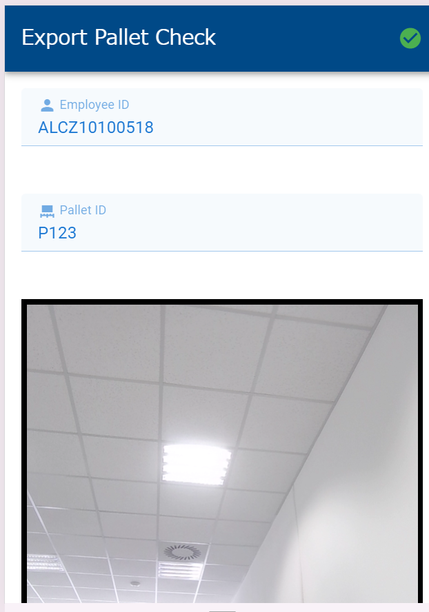
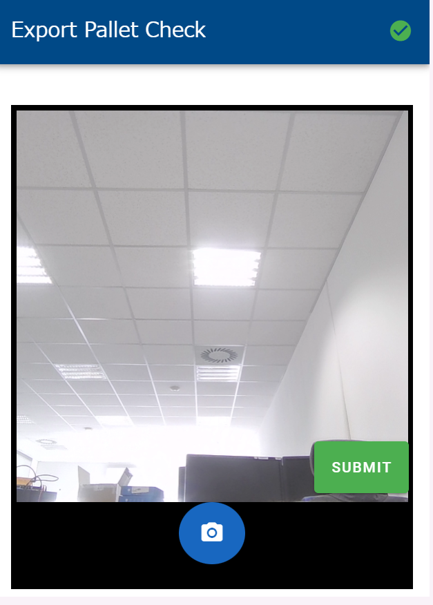
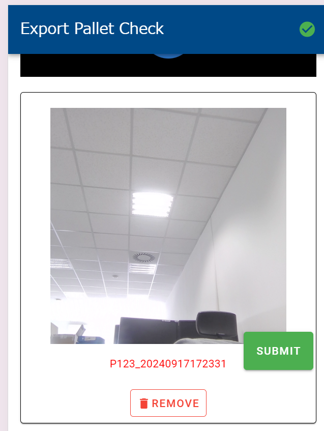

# pallet evidence


## Overview
This project is designed to manage and track shipping pallet information in a warehouse. It stores photo data in a local folder, along with pallet IDs, employee IDs, and photo names in a JSON file. Additionally, the backend server updates the database with new records corresponding to the stored photos each time photos are submitted from the client side.


|  |  |  |
|------------------------------------------|------------------------------------------|------------------------------------------|


## Getting started
### Prepare Virtual Environment
You need to create a virtual environment for this project. 
For more detail information see the following document. https://fastapi.tiangolo.com/virtual-environments/#activate-the-virtual-environment


### Launch server

Run the following command and launch the backend server.
```
fastapi dev main.py
```


## Configurable value
If you want to set some values as what you need, you can run 
```

``` 
After that, launch the server again.

## Notes 
### Configuring the Barcode Reader
You need to configure the barcode reader to send the ENTER key after scanning. To do this, open the **DataWedge application** and navigate to **DataWedge Profiles > Keystroke Output > Basic data formatting**. On this page, enable both **Send data** and **Send ENTER key options**.

For more details, please refer to the following document: DataWedge for Android - Send Enter or Tab after scanning.


For more detail information see the following document. https://supportcommunity.zebra.com/s/article/DataWedge-for-Android-Send-Enter-or-Tab-after-scanning?language=en_US
